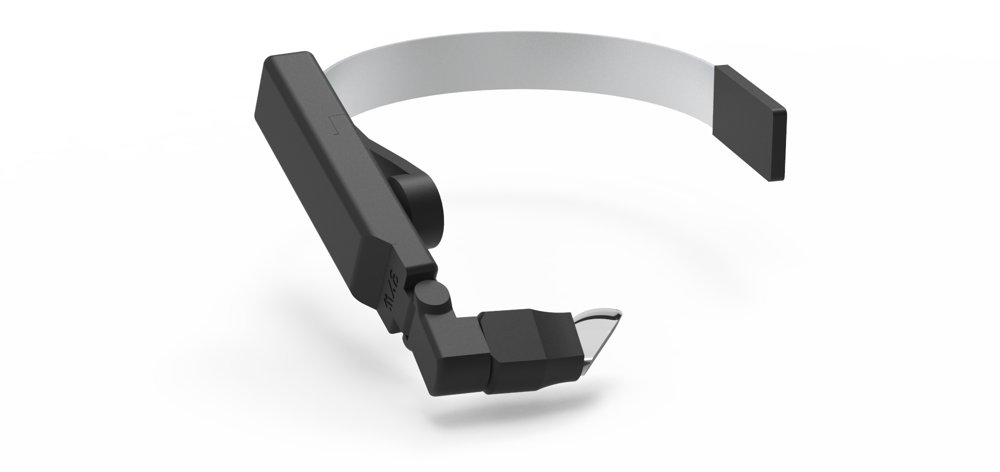
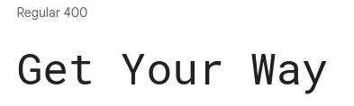

# flutter_gyw

**flutter_gyw** is a Flutter package developed and maintained by the Belgian company [Get Your Way](https://www.getyourway.be) to communicate with their devices via Bluetooth. This package allows developers to create Flutter applications that can send drawings, text, and icons to **aRdent smart glasses**.

<div style="text-align: center;">
  
</div>

Note that this package is still in development and is currently private. As such, you are not allowed to distribute it without Get Your Way's agreement. The team is fully open to your suggestions for the future of the package, and if you find a bug, do not hesitate to contact them.

## Features

### Bluetooth capability

* Connect to any Bluetooth device (unsecured)
* Disconnect from a previously connected Bluetooth device
* Scan for surrounding Bluetooth devices

### GYW display capabilities

* Display a text at a given postion
* Font selection
  * See `fonts.dart` [documentation](flutter_gyw/GYWFonts.html) for available fonts
* Display a 48x48 icon at a given position
  * See `icons.dart` [documentation](flutter_gyw/GYWIcons.html) for available icons
* Provide the specification of the GYW aRdent device screen
  * See `screen.dart` [documentation](flutter_gyw/GYWScreenParameters-class.html) for details

## Installation

To install the package, add this to your `pubspec.yaml` file:

Using Github repository
```yaml
dependencies:
  flutter_gyw:
    git:
      url: https://github.com/getyourway/flutter_gyw.git
      ref: master
```

> :bulb: If you want to use the latest features, you can reference the **develop** branch. However, these features are not merged, so they may lead to errors. Please report them if you see some.

Now in your Dart code, you can use

```dart
import 'package:flutter_gyw/flutter_gyw.dart';
```

## Usage

### Step 1 : Scan for Bluetooth Device

First, scan for surrounding Bluetooth devices using the `GYWBtManager` object ([documentation](flutter_gyw/GYWBtManager-class.html)).

```dart
await GYWBtManager.instance.refreshDevices();

final List<GYWBtDevice> devices = GYWBtManager.instance.devices;
```

### Step 2 : Connect to a BTDevice

Then, pick the `GYWBtDevice`  ([documentation](flutter_gyw/GYWBtDevice-class.html)) you are interested in, and establish a connection.

```dart
await device.connect();
```

### Step 3 : Make a drawing

Create a list of drawings that you want to send to the device.

```dart
final List<GYWDrawing> drawings = [
  TextDrawing(
    text: "Hello world",
    left: 40,
    top: 40,
  ),
];
```

### Step 4 : Send the drawings

Send the drawings to the connected device.

```dart
for (GYWDrawing drawing in drawings) {
  device.sendDrawing(drawing);
}
```

## Example

A complete example can be found [here](example/example.dart)

## Drawings

Here is a list of the different elements that can be shown on the screen. For more information on parameters and authorized values, feel free to look at the code documentation for more advanced details.

### 1. TextDrawing

Displays text on the screen.

```dart
final drawing = TextDrawing(
  text: "Hello, World!",
  left: 220,
  top: 50,
  font: GYWFonts.robotoMonoBold.font,
  colorHex: Colors.black.value,
  size: 34,
  maxWidth: 200,
  maxLines: 2,
);
```

The reason the constructor takes the color as an integer value (`Colors.black.value`) instead of a Color object (`Colors.black`) is that some color constants represent an entire palette of colors (`ColorSwatch`) and not a single color. Serializing and deserializing a color swatch will reduce it to a single color which breaks the equality between the original color and the deserialized one. To avoid surprises around inconsistent equality checks, the color is given as an integer to ensure it represents a single color. For convenience, a getter called `color` is provided which returns the color as a `Color` object. The same applies to other drawings.

### 2. IconDrawing

Displays an icon on the screen.

```dart
final drawing = IconDrawing(
  icon: GYWIcons.checkbox.icon,
  left: 220,
  top: 50,
  colorHex: Colors.blue.value,
  scale: 1.5,
);
```

Custom icons can also be displayed by instantiating an `GYWIcon`:

```dart
final myIcon = GYWIcon(
  name: "My Icon",
  // Make sure you have a file named "my_icon.svg" on the flash memory of the GYW glasses.
  filename: "my_icon",
  width: 48,
  height: 48,
);

final drawing = IconDrawing(
  myIcon,
  left: 220,
  top: 50,
  colorHex: Colors.blue.value,
  scale: 1.5,
);
```

### 3. RectangleDrawing

Draws a colored rectangle on the screen.

```dart
final drawing = RectangleDrawing(
  left: 220,
  top: 50,
  width: 100,
  height: 100,
  colorHex: Colors.red.value,
);
```

### 4. SpinnerDrawing

Draws an animated spinner.

```dart
final drawing = SpinnerDrawing(
  left: 300,
  top: 200,
  scale: 2.5,
  colorHex: Colors.blue.value,
  animationTimingFunction: AnimationTimingFunction.ease_out,
  spinsPerSecond: 1.5,
);
```

## Licence

Copyright (c) 2023 - Get Your Way SRL

This library is licensed under the Apache License, Version 2.0 (the "License"). You may not use this library except in compliance with the License. You may obtain a copy of the License at http://www.apache.org/licenses/LICENSE-2.0.

Unless required by applicable law or agreed to in writing, software distributed under the License is distributed on an "AS IS" BASIS, WITHOUT WARRANTIES OR CONDITIONS OF ANY KIND, either express or implied. See the License for the specific language governing permissions and limitations under the License.

## Troubleshooting

### My glasses are not listed in the list of devices, what can I do?

1. Check that the aRdent is on and not connected to any other device
2. Switch it off and back up
3. Kill your app and restart it, the disconnection process may not have been correctly

### How to reset the screen of the aRdent glasses?

`GYWDrawing` objects appear on the screen as a stack. Each new drawing will be printed over the previous one. Therefore, to reset the screen, you need to clear it.

To achieve this, you can call the `clearScreen` method.

```dart
device.clearScreen();
```

This will replace all previous drawings and create a blank canvas for new content to be displayed. A background color can also be given to this method. Not specifying a background color will clear the screen with the last background color used, or white if no background color has been specified yet.

Alternatively, if you only need to clear parts of the screen, such as erasing a single drawing, you can draw a `RectangleDrawing` without color. It will use the current background color to erase what is under it.

### How can I have bigger icons?

IconDrawing has a scale parameter that allows you to scale the icon up or down. If the icon is 48x48, a scale factor of 2.0 will result in a 96x96 icon. The scale factor has a range between 0.01 and 13.7. Any scale factor outside of this range will be clamped to the nearest value within the range.

### How can I troubleshoot connection issues with my GYW device?

If you encounter issues with connecting to your GYW device, here are a few things you can try:

1. Ensure that Bluetooth is enabled on the device running your Flutter app
2. Ensure that your app has the Bluetooth permissions to scan for and connect to devices.
3. Make sure that the GYW device is within range and not connected to any other device.
4. Check that the GYW device is discoverable by your Flutter app by scanning for devices using `GYWBtManager.instance.refreshDevices()`.
5. If the device is not listed, switch it off and then back on, and start a scan again.
6. Restart your app.
7. If you continue to have issues, please contact our support team for further assistance at [support@getyourway.be](mailto:support@getyourway.be)

### How can I send multiple drawings at the same time ?

Sending multiple drawings simultaneously is **not supported**.

The *send* operation is not atomic, and attempting to send an element while another is being displayed may result in timing issues, causing both drawings to be displayed incorrectly.

To address this limitation, consider the following solutions:

  1. Implement a mechanism to block any send operation while the device is in use for display. This can be achieved by using a `isSending` boolean flag that is set to `true` during the operation and reset to `false` at the end. Based on the state of this boolean, you can enable or disable certain action buttons to prevent the user from sending multiple drawings simultaneously.

  2. Create a waiting queue for requests made during an ongoing operation. When an element is sent while another drawing is being displayed, check the `isSending` flag. If it is `true`, add the new element to a queue. Once the current operation completes and the device is ready to display new elements, check the queue and display any pending elements before returning from the operation.

By implementing these solutions, you can ensure proper handling of multiple drawings and avoid potential timing issues when using the `sendDrawing` method in your Flutter application.

### What is the default font used on the device ?

The font used on the aRdent glasses is **RobotoMono**.



You can download it from [Google fonts](https://fonts.google.com/specimen/Roboto+Mono).
